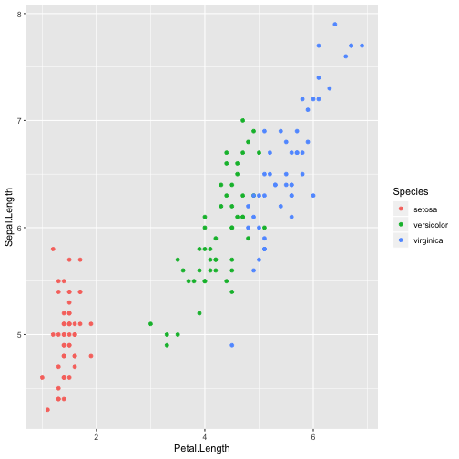
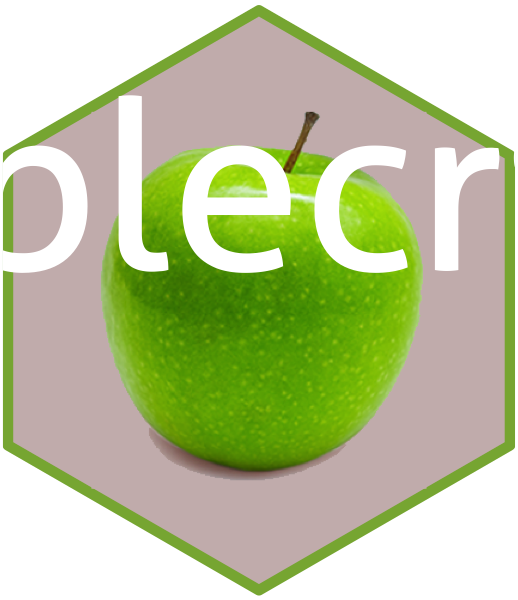

## Background:

Image files come in all kinds of formats. There's png, tiff, svg, pdf, just to name a few. What's the difference, and how can we work with them?

Reading: 

  - Identify online sources to read up on differences between image file formats. 

  - The `magick` package allows us to work with raster images in R. Read through the  [magick vignette](https://cran.r-project.org/web/packages/magick/vignettes/intro.html) to learn about the package's functionality.

Write a blog post answering the following questions and detailing the progress: 

1. **Describe the difference between formats png, svg, and pdf. State your sources with (working!) links (take a look at the RMarkdown cheatsheet for RStudio to learn how to make working links). Make one plot in ggplot2 and save it (using R code) in each of the three file formats you discussed. Comment on the differences you observe in their usage.**  

PNG and SVG are image file formats whereas PDF is for documents. One [software designer's blog](https://blog.idrsolutions.com/2010/04/understanding-the-pdf-file-format-how-are-images-stored/) explains how PDF actually stores the raw binary information for image and compiles the raw data each time the image is reconstructed. Thus, [another blog](https://www.shutterstock.com/blog/jpg-vs-png-vs-pdf) suggests only using PDF to store images for ease of sharing since in actuality the image has been converted to a document.  

On the other hand, PNG and SVG are two options among many for file storage. PNG stores image data in raster or pixel format which [do not scale well](https://quickleft.com/blog/choosing-svg-jpeg-png/), but PNG is the only raster image type that does allow for transparency. [SVG also allows transparency](https://www.pagecloud.com/blog/web-images-png-vs-jpg-vs-gif-vs-svg). However, SVG is a vector image format that stores images as mathematically declared shapes. SVGs stay clear for all resolutions and [can be animated](https://watb.co.uk/blog/5-reasons-you-should-be-using-svgs-over-pngs), but for photographs or complicated artwork, other file types are still preferred.  


library(tidyverse)
ggplot(data = iris, aes(x = Petal.Length, y = Sepal.Length, color = Species)) + 
  geom_point()



ggsave("iris.png")
ggsave("iris2.svg")
ggsave("iris3.pdf")


The SVG file does not display an image on my OS since I do not have a native SVG viewer. Instead, when I open the SVG file it contains xml code with what appears to be commands for shapes; one line is labelled for a rectangle, the graph's gray border. The PDF and PNG images look similar in clarity but the PNG file is 20 times larger than the PDF.

2. **Use `magick` functionality to create an image to be used for a hex sticker.**  package `hexSticker` can help you to get started on dimensions of the sticker. **Include all code necessary to produce your sticker.** In case you are using local images, post those in a folder on **your** website and use the URL to link to them.


library(magick)
apple <- image_read("http://usapple.org/wp-content/uploads/2016/02/apple-grannysmith-337x335.png")
newapple <- image_crop(apple, "280x315+25+10") %>% image_background("#BBCDDD") %>%
  image_fill("#CCBAB9", point = "+35+280", fuzz = 15)

library(hexSticker)
sticker(newapple, package = "applecrisp", 
        s_width = 1.3, s_height = 1.3, s_x = 1, s_y = 1,
        h_fill = "#CCBAB9", 
        p_size = 20)



