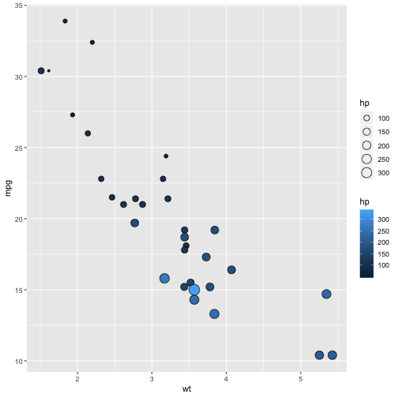
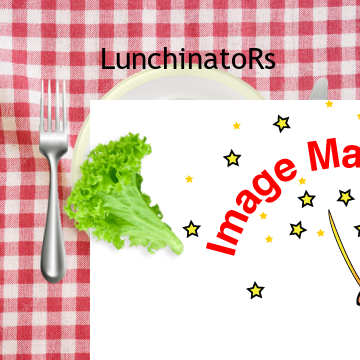
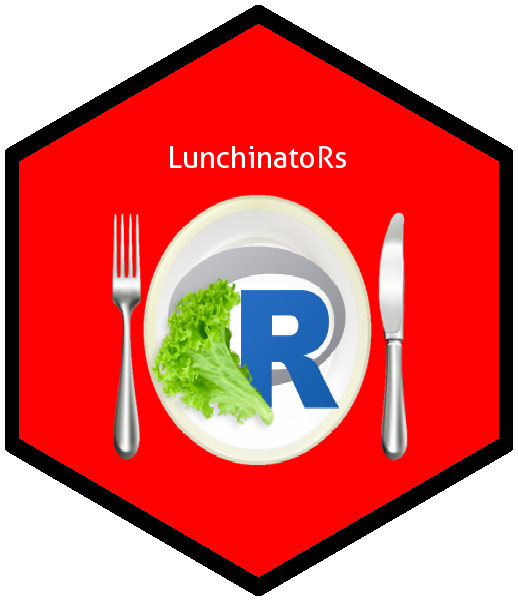

1. **Describe the difference between formats png, svg, and pdf. State your sources with (working!) links (take a look at the RMarkdown cheatsheet for RStudio to learn how to make working links). Make one plot in ggplot2 and save it (using R code) in each of the three file formats you discussed. Comment on the differences you observe in their usage.**

I had a hard time finding a site that covered these 3 files types, so I cobbled together a comparison via a conglomeration of  and . 

The differences seem to depend on your goal in life. If you are photographer, versus a graphic designer, versus a web-developer...your opinion is shaped by your background. 

A helpful 'high-level' distinction is raster (jpeg, gif, png) versus vector (pdf). Don't resize rasters - make them the size you will ultimately use. png = good for web. svg = outdated.  
png and svg both offer transparent backgrounds, pdf does not. png is better than svg. 

I made a figure in all three (png, pdf, svg) formats. 

Use **mtcars** to explore this


mtcars %>%
  ggplot(aes(wt, mpg)) + 
  geom_point(aes(size = hp, fill = hp), pch = 21)



#ggsave("myfig.png")
#ggsave("myfig.pdf")
#ggsave("myfig.svg")

#ggsave("myfig2.png", height = 3, width = 3)
#ggsave("myfig2.pdf", height = 3, width = 3)


svg required the installation of the svglite package AND it took *FOREVER*. Plus, I couldn't view it. 

I tried each png and pdf at 7x7" and 3x3" to see if the size made a difference. It didn't. I think the pdf looked a little sharper. 

2. Make a sticker!

Read in each image separately


clth <- image_read("https://vanichols.github.io/picniccloth.jpg") %>%
  image_scale("360")

uten <- image_read("https://vanichols.github.io/utensils.png") %>%
  image_scale("300")

logo <- image_read_svg("https://vanichols.github.io/Rlogo.svg") %>%
  image_scale("175") %>%
  image_trim()



## Error in loadNamespace(name): there is no package called 'rsvg'



ltc <- image_read("https://vanichols.github.io/lettuce.png") %>%
  image_scale("125")


Overlay the images, with a picnic background


image_composite(clth, uten, offset = "+35+60") %>%
  image_composite(logo, offset = "+90+100") %>%
  image_composite(ltc, offset = "+60+130") %>%
  image_annotate("LunchinatoRs", 
                 size = 30, location = "+100+40",
                 font = "Trebuchet") 


Make it without the picnic background becacuse **hexsticker** isn't quite as smart as I want it to be. 


mycomp <- image_read("https://vanichols.github.io/magick-lunchinators2.png")

sticker(mycomp, package="LunchinatoRs", 
        p_x = 1, p_y = 1.5, p_size=8, 
        s_x = 1, s_y = 0.9, s_width=0.6, s_height=0.2,
        h_size = 2, h_fill = "red", h_color = "black",
         filename="GinasLunchinatorsHex.png")


Here is what it should spit out for you:


image_read("https://vanichols.github.io/hexpractice.png")


