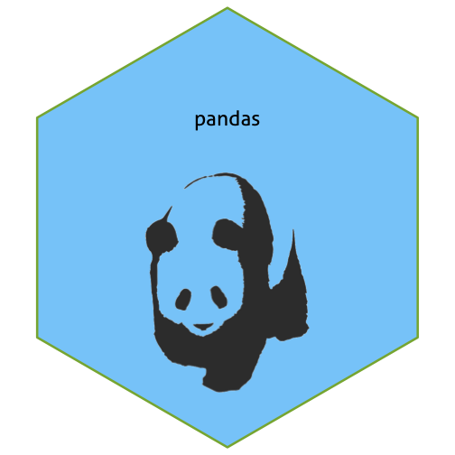

Write a blog post answering the following questions and detailing the progress: 

1. **Describe the difference between formats png, svg, and pdf. State your sources with (working!) links (take a look at the RMarkdown cheatsheet for RStudio to learn how to make working links). Make one plot in ggplot2 and save it (using R code) in each of the three file formats you discussed. Comment on the differences you observe in their usage.**
    
    Source: [图片文件格式知多少](http://www.bgteach.com/article/133), [Image File Formats](https://www.logaster.com/blog/jpg-png-svg-pdf-formats/), [Advanced Formats](http://designer-info.com/Writing/advanced_file_formats.htm).  
    - png: Portable Network Graphics. A raster format compressed without quality loss. It supports transparency, has small storage and can handle full colour.
    - svg: Scalable Vector Graphics. A 2D-vector format without quality loss. It is written in XML in text format, can be edit using text editor. It has small storage.
    - pdf: Portable Document Format. A vector format. It may contain vector and raster elements. It packages font, color, style inside, independent of device.

    After saving ggplot, pdf and svg are vector formats while png is bitmap format. The storage size: pdf < png < svg.
    


saveImg <- function(f, p) {f(paste0("plot.", substitute(f))); suppressMessages(print(p)); dev.off(); invisible()}
p <- ggplot2::qplot(mpg, wt, data = mtcars, geom = c("point", "smooth"))
saveImg(png, p)
saveImg(svg, p)
saveImg(pdf, p)


2. **Use `magick` functionality to create an image to be used for a hex sticker.**  package `hexSticker` can help you to get started on dimensions of the sticker. **Include all code necessary to produce your sticker.** In case you are using local images, post those in a folder on **your** website and use the URL to link to them.


library(dplyr)
library(magick)
library(hexSticker)
panda <- image_read('https://upload.wikimedia.org/wikipedia/commons/8/8e/Panda_vector.svg') %>%
  image_trim %>% image_transparent("white")
sticker(panda, package = "pandas", s_x = 1, s_width = 0.8, s_height = 1, p_y = 1.5, p_color = "black", h_fill = "lightskyblue") %>% print


