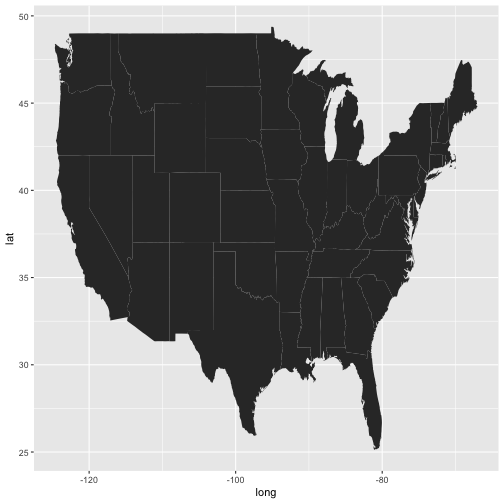
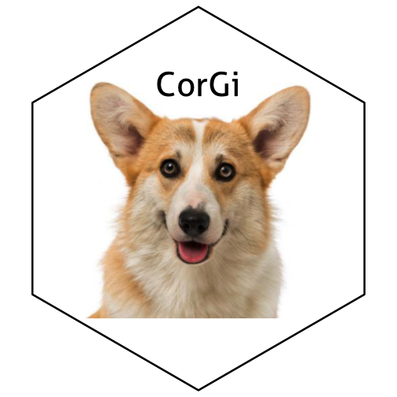

1. **Describe the difference between formats png, svg, and pdf. State your sources with (working!) links (take a look at the RMarkdown cheatsheet for RStudio to learn how to make working links). Make one plot in ggplot2 and save it (using R code) in each of the three file formats you discussed. Comment on the differences you observe in their usage.**
After reviewing a couple of web pages, I found out similar definitions and explanations about this topic.So, I just decided to use a couple of them [here]("https://www.pagecloud.com/blog/web-images-png-vs-jpg-vs-gif-vs-svg") and [here]("https://www.95visual.com/blog/svg-pdf-jpg-png-whats-the-difference").\

PNG (Portable Network Graphics) files do not require much space to be saved, so they are good choices when it comes to compare the size. PNGs are most often used for static images, like a JPG would, however they can support animation. PNG is lossless, so you do not lose any data during compression, and they’re ideal for detailed graphics, or when you’re working with files that are still being edited. It’s the only raster format of the four that supports transparency.\

SVG (Scalable Vector Graphics) is a vector image file form. It is more powerful than other file formats suitable for the web. Unlike raster formats seen in JPG, GIF, and PNG, an SVG image remains crisp and clear at any resolution or size. Like PNG, SVG’s can be animated, support transparency, and any combinations of colors or gradients.\

PDF is a file format that can be used to provide an electronic image of text or text and graphic that looks the same as a printed document. A PDF file can be viewed, printed or electronically transmitted by uploading, downloading or attaching it to a message or email. The benefit of using a PDF format is that links can be embedded in the document and the file sizes are usually smaller than if you saved a document in its native format including its graphic files.


## 
## Attaching package: 'maps'



## The following object is masked from 'package:purrr':
## 
##     map


The R base functions to save images as your favorite format are `jpeg`, `png()`, `svg()` or `pdf()`. Therefore, using these functions to save our image results as follows. 

###PNG


png(filename = "usmap.png", width = 800, height = 500, units = "px")
usmap
dev.off()



## quartz_off_screen 
##                 3

### PDF


pdf(file = "usmap.pdf", width =4 , height = 3, onefile = TRUE)
usmap
dev.off()



## quartz_off_screen 
##                 3

###SVG


svg(filename = "usmap.svg", width =10 , height = 8 )
usmap
dev.off()



## quartz_off_screen 
##                 3

I see that the `svg` format is of high quality and it does keep the quality as the width and height of the image increases. `png` as expected, does not take much space. In this small exercise, I did not see much difference among the file size of `png` and `pdf`

  
2. **Use magick functionality to create an image to be used for a hex sticker. package hexSticker can help you to get started on dimensions of the sticker. Include all code necessary to produce your sticker. In case you are using local images, post those in a folder on your website and use the URL to link to them.**


library(hexSticker)
corgi <- image_read("https://t1.ea.ltmcdn.com/en/razas/0/5/5/img_550_pembroke-welsh-corgi_0_600.jpg") 
corgi<-image_scale(image = corgi, geometry = "500") 
corgi<-image_crop(image = corgi, geometry = "285x300+130-35")
sticker<-sticker(corgi,package="CorGi",p_size=15, p_color="black",p_y=1.6,s_x=1,s_y=1, s_width=1.25,s_height = 1.25, h_fill="white",h_color="black")
sticker


