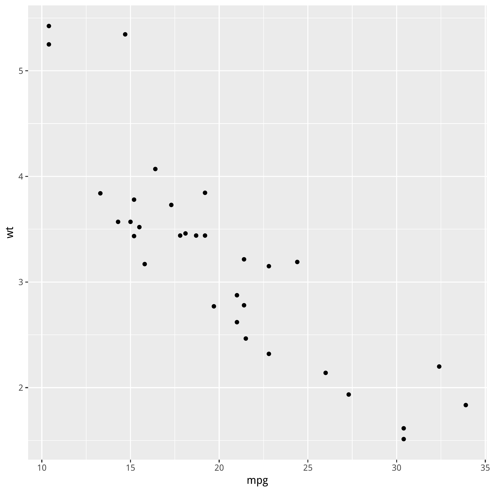
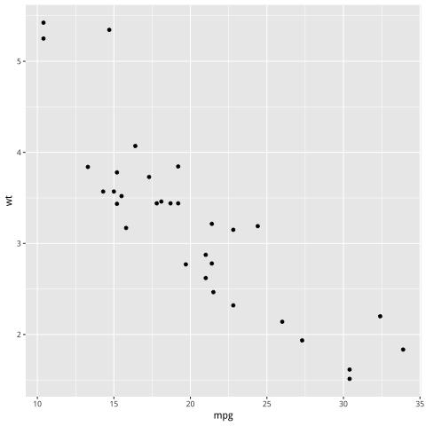
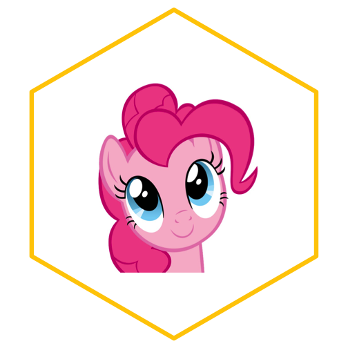

##Question1
The png file format is for bitmap image. The png image is with a fixed number of pixels, which means zooming in can lead to unclear image (mosaic) and zooming out can lead to over-edged image.  
The svg file format is for vector image. The vector image stores the every parts as geometric forms, which means the zooming in or zooming out will not change the quality of the image.  
The pdf file format is a good way to store high quality image because it is uncompressed. The disadvantage is that pdf file format is larger than png or svg.  
The reference:   
[the difference between png and svg](http://asiapacific.anu.edu.au/mapsonline/faq/what-difference-between-png-file-raster-image-and-svg-file-vector-image)  
[The difference between svg, pdf, jpg, png](https://www.95visual.com/blog/svg-pdf-jpg-png-whats-the-difference)  


library(magick)
library(hexSticker)
library(tidyverse)


###Make a plot and save it as different formats


data("mtcars")
p <- mtcars %>% ggplot(aes(mpg, wt)) + geom_point()
print(p)



pdf("p.pdf")
print(p)
dev.off()



## quartz_off_screen 
##                 2



png("p.png")
print(p)
dev.off()



## quartz_off_screen 
##                 2



svg("p.svg")
print(p)
dev.off()



## quartz_off_screen 
##                 2


###read the image files in.


p_pdf <- image_read_pdf("p.pdf")
print(p_pdf)



## # A tibble: 1 x 7
##   format width height colorspace matte filesize density
##   <chr>  <int>  <int> <chr>      <lgl>    <int> <chr>  
## 1 PNG     2100   2100 sRGB       TRUE         0 72x72



p_png <- image_read("p.png")
print(p_png)



## # A tibble: 1 x 7
##   format width height colorspace matte filesize density
##   <chr>  <int>  <int> <chr>      <lgl>    <int> <chr>  
## 1 PNG      480    480 sRGB       TRUE     16902 72x72



p_svg <- image_read_svg("p.svg")



## Error in loadNamespace(name): there is no package called 'rsvg'



print(p_svg)



## Error in print(p_svg): object 'p_svg' not found

  
Apparently, the pdf format provides the highest quality image and the size is very large. The png and svg format provide smaller image, however, the svg format image could set into different size without the loss of quality.   

##Question2 Make a hex sticker  
I used a Pinkiepie image from internet.  


p <- image_read("https://yt3.ggpht.com/a-/AAuE7mBxIGzZtVzbMIiGLJMN6jnhuXeSlBCMEMK8Nw=s900-mo-c-c0xffffffff-rj-k-no")

p.1 <- sticker(p,
               package=" ", 
               s_x = 1, 
               s_y = 1, 
               s_width = 1.2, 
               s_height = 1.2, 
               p_x = 1, 
               p_y = .43, 
               p_size = 6, 
               p_color = "#FFCB00", 
               h_size = 3, 
               h_fill = "#FFFFFF", 
               h_color = "#FFCB00") 
p.1


