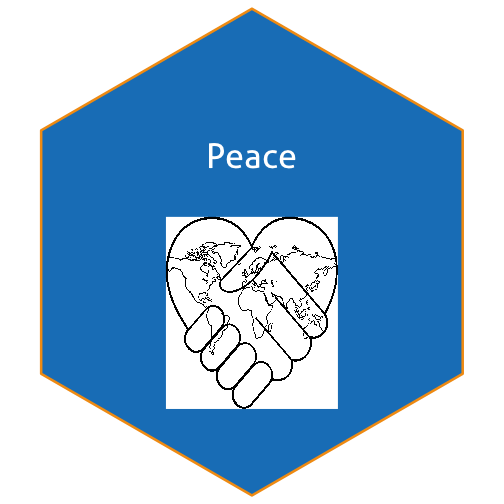

## Background:

Image files come in all kinds of formats. There's png, tiff, svg, pdf, just to name a few. What's the difference, and how can we work with them?

Reading: 

  - Identify online sources to read up on differences between image file formats. 

  - The `magick` package allows us to work with raster images in R. Read through the  [magick vignette](https://cran.r-project.org/web/packages/magick/vignettes/intro.html) to learn about the package's functionality.

Write a blog post answering the following questions and detailing the progress: 

1. **Describe the difference between formats png, svg, and pdf. State your sources with (working!) links (take a look at the RMarkdown cheatsheet for RStudio to learn how to make working links). Make one plot in ggplot2 and save it (using R code) in each of the three file formats you discussed. Comment on the differences you observe in their usage.**

Portable Network Graphics (PNGs): PNG is a high-quality file format. This format is a lossless quality file. This means that it does not blur when uploaded. 

TIIF format is high-quality format. But it never gets compressed out of the box.

SVG is an excellent format for website design. And it is lightweight in file sizee, meaning it loads faster.

PDF forma is requested by print shops. It is vector file format, that's why it is not pixelated when users print it. 


library(tidyverse)
plot <- ggplot(aes(x = mpg, y = wt), data = mtcars) + geom_point()

ggsave("plot.png")



## Saving 7 x 7 in image



ggsave("plot.tiff")



## Saving 7 x 7 in image



ggsave("plot.pdf")



## Saving 7 x 7 in image



svg("plots.svg")


2. **Use `magick` functionality to create an image to be used for a hex sticker.**  package `hexSticker` can help you to get started on dimensions of the sticker. **Include all code necessary to produce your sticker.** In case you are using local images, post those in a folder on **your** website and use the URL to link to them.


imgurl <- "https://ayoqq.org/images/nation-drawing-peaceful-world-10.gif"
sticker_peace <- sticker(imgurl, package="Peace", p_size=12, s_x=1, s_y=.75, s_width=0.4, h_color="#f39c12")



## Warning: Ignoring unknown parameters: image_colour



sticker_peace


