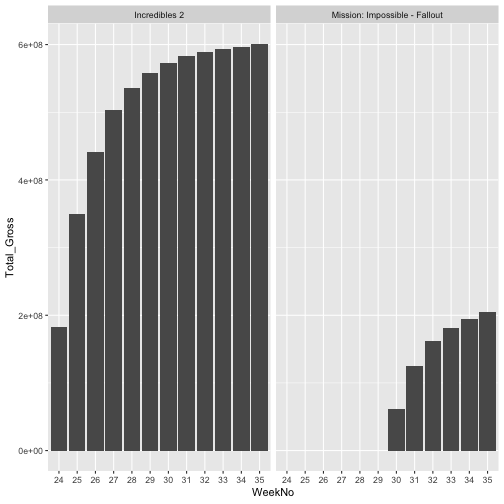

1.Describe the difference between formats png, svg, and pdf. State your sources with (working!) links (take a look at the RMarkdown cheatsheet for RStudio to learn how to make working links). Make one plot in ggplot2 and save it (using R code) in each of the three file formats you discussed. Comment on the differences you observe in their usage. 

 [Joshua Maddux](https://www.95visual.com/blog/svg-pdf-jpg-png-whats-the-difference) describes the diffrence between different file formats.
___SVG__ file can be opened in any browser and can be used to create icons.It can be comperessed without quality loss. This type of graphic file can be opened in any browser. SVG is used to create icons that are used on websites. An SVG image can be compressed or stretched without loss of image quality. problem with this format is that, needs all the elements to be loaded and it is not possible to load just part of the graphic object which could slow down the website.

__png__ or Portable Network Graphics,  is used almost exclusively for images used on websites. Because of the size of a PNG file, this format is not recommended for photos as JPG is unless file size is not an issue. If you have a mixture of images that have line art and text, the PNG format will make the image look sharper instead of appearing bitmapped. The higher levels of PNG support transparency like GIFs do. This makes the PNG format suitable for web images like logos that you want to include transparency and fading effects too.

__pdf__: The benefit of using a PDF format is that links can be embedded in the document and the file sizes are usually smaller than if you saved a document in its native format including its graphic files.PDF is a file format that can be used to provide an electronic image of text or text and graphic that looks the same as a printed document. A PDF file can be viewed, printed or electronically transmitted by uploading, downloading or attaching it to a message or email. 


library(classdata)



## 
## Attaching package: 'classdata'



## The following object is masked from 'package:GGally':
## 
##     happy



library(ggplot2)
mojo<-mojo

b_o<-filter(mojo,mojo$Year==2018)
d<-mojo[which(mojo$Title %in% c("Incredibles 2","Mission: Impossible - Fallout")& mojo$Year==2018),]
d$"Total_Gross"<-d$"Total Gross"
d$WeekNo<-factor(d$WeekNo)
ggplot(data=d, aes(x=WeekNo,y=Total_Gross))+facet_wrap(~Title)+geom_bar(stat = "Identity")



ggsave("ploti.pdf", plot = last_plot(), device = "pdf")



## Saving 7 x 7 in image



ggsave("ploti.png", plot = last_plot(), device = "png")



## Saving 7 x 7 in image



ggsave("ploti.svg", plot = last_plot(), device = "svg")



## Saving 7 x 7 in image


2. Use magick functionality to create an image to be used for a hex sticker. package hexSticker can help you to get started on dimensions of the sticker. Include all code necessary to produce your sticker. In case you are using local images, post those in a folder on your website and use the URL to link to them.


library(magick)
tiger <- image_read_svg('http://jeroen.github.io/images/tiger.svg', width = 400)



## Error in loadNamespace(name): there is no package called 'rsvg'



#t<-image_read('https://github.com/atousaz/atousaz.github.io/blob/master/image/norow.jpg')
#image_read("https://github.com/atousaz/atousaz.github.io/blob/master/image/norow.jpg")
image_scale(tiger, "200")



## Error in assert_image(image): object 'tiger' not found

