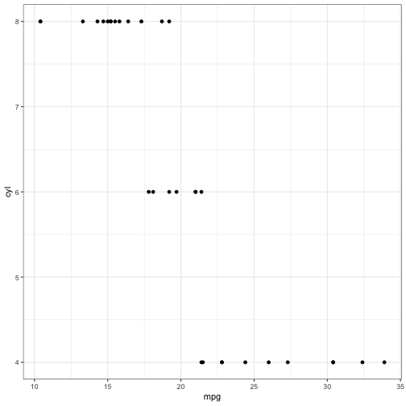

1. **Describe the difference between formats png, svg, and pdf. State your sources with (working!) links (take a look at the RMarkdown cheatsheet for RStudio to learn how to make working links). Make one plot in ggplot2 and save it (using R code) in each of the three file formats you discussed. Comment on the differences you observe in their usage.**

    Links:
    
    [What is the difference between a png file (raster image) and a svg file (vector image)?](http://asiapacific.anu.edu.au/mapsonline/faq/what-difference-between-png-file-raster-image-and-svg-file-vector-image)

    [THE FILE GUIDE: DIFFERENCES BETWEEN JPG, PNG, EPS, PDF, PSD, AI, GIF, TIFF](https://builtbytophat.com/file-guide-differences-between-jpg-png-eps-pdf-psd-ai-gif-tiff/)

    [PDF, From Wikipedia](https://en.wikipedia.org/wiki/PDF)

    * png: Portable Network Graphics. File is a raster or bitmap image file format. A raster image is made up of a fixed number of  pixels (or building blocks) that form a complete image. The image cannot be enlarged without distortion occurring.

    * svg: Scalable Vector Graphics. File is a vector image file format. A vector image uses geometric forms such as points, lines, curves and shapes (polygons) to represent different parts of the image as discrete objects. These forms can be individually edited. A vector image remains crisp and clear at any resolution or size.

    * pdf: Portable Document Format. It is not specific for images only so it can include both png and svg. They are useful for file sharing as it creates an exact replica of any file you want to duplicate. It is hard to edit.
    
    
    
    library(ggplot2)
    library(tidyverse)
    p <- mtcars %>% ggplot()+
      geom_point(aes(x=mpg, y = cyl))+
      theme_bw()
    p
    
    
    
    
    
    ggsave("~/Desktop/p.png")
    ggsave("~/Desktop/p.svg")
    ggsave("~/Desktop/p.pdf")
    

    The most obvious distinction lies in the storage size: the storage size for pdf is the smallest, and the size for svg is the largest. Besides, I will see the rough edges along the points when I zoom in within the png file.

2. **Use `magick` functionality to create an image to be used for a hex sticker.**  package `hexSticker` can help you to get started on dimensions of the sticker. **Include all code necessary to produce your sticker.** In case you are using local images, post those in a folder on **your** website and use the URL to link to them.

    
    
    library(magick)
    library(hexSticker)
    image <- image_read("https://cdn1.iconfinder.com/data/icons/halloween-2072/500/halloween-cartoon-horror-cute_4-512.png") %>% image_transparent("gray")
    s <- sticker(image, package = "cat", h_fill="gray", h_color = "black", s_x=1, s_y=0.9, s_width=1.3, s_height=1.2, p_color="yellow", p_family = "serif", p_size = 16, p_y = 1.6)
    s
    
    
    

