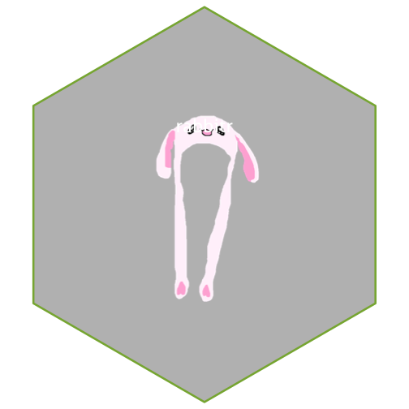

1. **Describe the difference between formats png, svg, and pdf. State your sources with (working!) links (take a look at the RMarkdown cheatsheet for RStudio to learn how to make working links). Make one plot in ggplot2 and save it (using R code) in each of the three file formats you discussed. Comment on the differences you observe in their usage.**
Source :[SVG, PDF, JPG, PNG; WHAT'S THE DIFFERENCE?](https://www.95visual.com/blog/svg-pdf-jpg-png-whats-the-difference)
        [Image file formats: everything you’ve ever wanted to know](https://99designs.com/blog/tips/image-file-types/#PDF)

   -PNG: Compared to the other two, it is a raster format. This is pixel image, increasing the size will lose some information. And it has small file size compared with PDF.
   -PDF: Very high quality, it has a vector graphics foundation, but don't use PDF if you want to edit it wants to be consistent with the original one.
   -SVG: It is pretty young and same as PNG has a small size, it is a XML-based vector image format for two-dimensional graphics. It can be eidted, and supported by things like HTML, CSS, and Canvas.
   


library(tidyverse)
library(magick)
p <- iris %>% ggplot() +
    geom_point(aes(x = Sepal.Length, y = Sepal.Width)) +
    facet_wrap(~Species)
ggsave(file='iris.svg')



## Saving 7 x 7 in image



ggsave(file='iris.pdf')



## Saving 7 x 7 in image



ggsave(file='iris.png')



## Saving 7 x 7 in image

PDF takes a lot of space, but good for showing people since it is a high quality.

2. **Use `magick` functionality to create an image to be used for a hex sticker.**  package `hexSticker` can help you to get started on dimensions of the sticker. **Include all code necessary to produce your sticker.** In case you are using local images, post those in a folder on **your** website and use the URL to link to them.


rabbit <- image_read("https://upload.wikimedia.org/wikipedia/commons/c/c6/Rabbit_hat_4636414.png")
sticker <- sticker(rabbit, package = "rabbitr", s_x = 1, s_y = 1, s_width = 1, s_height = 1, h_fill = "gray")
sticker


