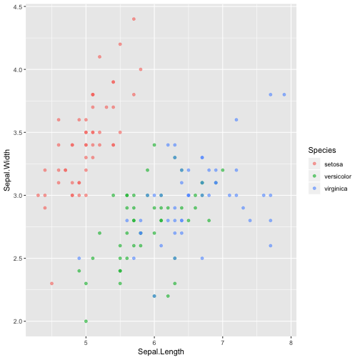

1. **Describe the difference between formats png, svg, and pdf. State your sources with (working!) links (take a look at the RMarkdown cheatsheet for RStudio to learn how to make working links). Make one plot in ggplot2 and save it (using R code) in each of the three file formats you discussed. Comment on the differences you observe in their usage.**

SVG is vector image, which can be compressed or stretched without loss of image quality. It support CSS editing. One can make a SVG file use a text edit.SVG can be opened in any browser. SVG image element files are smaller than if the image were present in a raster format. A potential issue with SVG is that you have to load all part of the graphic object.

PDF can be both vector image and raster image. PDF files can be password protected

PNG is used almost exclusively for images used on websites. PNG is raster image compressed without quality loss. It supports  transparency and fading effects, has small storage and can handle full color.


Reference: <https://www.95visual.com/blog/svg-pdf-jpg-png-whats-the-difference>



library(tidyverse)
library(magick)
library(hexSticker)

data("iris")
iris <- data.frame(iris)

p <- iris %>% ggplot( aes(Sepal.Length, Sepal.Width, colour = Species)) + 
    geom_point(alpha = .6) 

p





ggsave("plot.pdf", plot=p, width = 8, height =6)
ggsave("plot.png", plot=p, width = 8, height =6)
ggsave("plot.svg", plot=p, width = 8, height =6)


The size of pdf is smallest, and the pdf generated by the R code is vector image.
The size of png is largest. the png file is raster image.
The size of svg is vector image. The size of this svg is larger than pdf, that is because that the object in the image contains many small elements.


```
-rw-rw-r-- 1 ying ying  41585 Mar 13 14:18 plot.svg
-rw-rw-r-- 1 ying ying 139515 Mar 13 14:18 plot.png
-rw-rw-r-- 1 ying ying  11508 Mar 13 14:18 plot.pdf
```


2. **Use `magick` functionality to create an image to be used for a hex sticker.**  package `hexSticker` can help you to get started on dimensions of the sticker. **Include all code necessary to produce your sticker.** In case you are using local images, post those in a folder on **your** website and use the URL to link to them.



Doraemon <- image_read("https://raw.githubusercontent.com/floatgreen/Introduction_to_R/master/Doraemon2.png")

Doraemon <- Doraemon %>% image_trim


sticker(Doraemon, s_x = 1, s_width = 0.8, s_height = 0.8, package = "Doraemon", p_color = "black", p_size = 12, h_color = "#c98d34", h_fill = "#a9c5f2")


knitr::include_graphics("https://raw.githubusercontent.com/floatgreen/Introduction_to_R/master/Doraemon.png")



