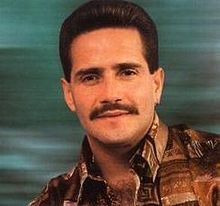

### Background

The internet may not be [a series of
tubes](https://en.wikipedia.org/wiki/Series_of_tubes), but it is made up
of a number of different programming and markup languages. It is useful
to develop a basic vocabulary and understanding of these languages
before attempting to interact with (messy) data stored on the internet.

&lt;A&gt;: Like &lt;/a&gt;this.&nbsp;"

As the reading material for this week, you are asked to read through a
set of websites on XML and HTML and navigating through them:

-   **XML (eXtensible Markup Language):** XML is a generic markup
    framework. Many different common file types are based on or related
    to XML structure (for instance, .docx, .xlsx, .html)   Read the
    following sections of w3schools.com’s Introduction to XML:

    -   [XML Introduction](https://www.w3schools.com/xml/xml_whatis.asp)
    -   [XML How to Use](https://www.w3schools.com/xml/xml_usedfor.asp)
    -   [XML Tree](https://www.w3schools.com/xml/xml_tree.asp)
    -   [XML Syntax](https://www.w3schools.com/xml/xml_syntax.asp)
    -   [XML Elements](https://www.w3schools.com/xml/xml_elements.asp)
    -   [XML
        Attributes](https://www.w3schools.com/xml/xml_attributes.asp)

-   **HTML (HyperText Markup Language):** HTML focuses on the display of
    information in a document format. XML is a much more general
    framework, but most of the concepts (tags, attributes, elements)
    apply directly to HTML. Open up the [w3schools HTML
    page](https://www.w3schools.com/html/default.asp) and read the
    introduction, then look through a few topics in the tutorial that
    interest you.

-   **Navigation: HTML, CSS, XPATH, and more:** In many situations, it
    is helpful to be able to pick out specific parts of an HTML or XML
    file - for example, a table with useful data. CSS (Cascading Style
    Sheets) Selectors and XPATH are two methods commonly used to
    identify specific nodes in HTML or XML documents.

    -   [XPATH Syntax](https://www.w3schools.com/xml/xpath_syntax.asp)
    -   [CSS Selector
        Syntax](https://www.w3schools.com/cssref/css_selectors.asp)

**Write a blog post answering the following questions and detailing the
progress: **

1.  The `xml2` R package can be used to work with xml files. Write a
    function, `current_weather` that accepts a 4-letter airport code
    (KAMW in the URL here:
    <a href="https://w1.weather.gov/xml/current_obs/KAMW.xml" class="uri">https://w1.weather.gov/xml/current_obs/KAMW.xml</a>)
    and returns a data frame with the airport location (station ID,
    latitude, longitude), last update time, and current weather
    information (temperature, weather condition, wind speed and
    direction) at that airport. The `xml2` functions `read_xml`,
    `xml_children`, `xml_name`, and `xml_text` will be useful. Remember
    to handle errors and check inputs, and make sure to return a data
    frame with appropriate data types.

<!-- -->

    library(xml2)
    library(tidyverse)
    library(purrr)

    current_weather <- function(code){
      
      ## Here we conduct a couple of sanity checks
      if(!is.character(code)){
        stop('The code should be a character value!')
      }
      
      if(nchar(code) != 4){
        stop("The code should have 4 characters!")
      }
      
      ## Here we read data and extract some information
      wdat <- read_xml(paste0("https://w1.weather.gov/xml/current_obs/", code,".xml"))
      namew <- wdat %>% xml_children %>% xml_name
      wdatname <- paste0("//", namew[c(6:9, 11, 14:16, 18:20)])
      data.out <- wdatname %>% purrr::map(xml_find_all, x = wdat) %>% purrr::map_chr(xml_text) %>% t() %>%  data.frame()
      
      ## Here we add the names to the variables
      names(data.out) <- namew[c(6:9, 11, 14:16, 18:20)]
      
      ## Here we put the varuables in the appropriate format
      data.out <- data.out %>% mutate_at(c("location", "station_id", "observation_time_rfc822", "wind_dir"), 
                                         as.character)
      
      data.out <- data.out %>% mutate_at(c("latitude","longitude","temp_f","temp_c","relative_humidity","wind_degrees",
                                           "wind_mph"), as.character) %>%
                               mutate_at(c("latitude","longitude","temp_f","temp_c","relative_humidity","wind_degrees",
                                           "wind_mph"), as.double)
      
      ## Here we make sure that we are returning a data frame
      if(!is.data.frame(data.out)){
        stop('Error: the output is not a data frame!')
      }
      
      return(data.out)
    }

    ## Here we check the function
    to.check <- current_weather("KAMW")
    to.check

    ##                           location station_id latitude longitude
    ## 1 Ames, Ames Municipal Airport, IA       KAMW 41.99056 -93.61889
    ##           observation_time_rfc822 temp_f temp_c relative_humidity
    ## 1 Tue, 02 Apr 2019 10:53:00 -0500     39    3.9                76
    ##    wind_dir wind_degrees wind_mph
    ## 1 Northwest          300     10.4

1.  Which HTML tags did you investigate? Describe how to format at least
    3 separate pieces of a document using HTML tags.

Color: <!--html_preserve-->
<h1 style="background-color:DodgerBlue; color:white">
Machine learning is cool!
</h1>
<!--/html_preserve-->
Table: <!--html_preserve-->
<table style="width:50%">
<tr>
<th>
Academia
</th>
<th>
Industry
</th>
</tr>
<tr>
<td>
Statistical learning
</td>
<td>
Machine learning
</td>
</tr>
</table>
<!--/html_preserve-->
Link: <!--html_preserve-->
<a href="https://conferences.oreilly.com/strata/strata-ca" target="_blank">STRATA
San Francisco</a> <!--/html_preserve-->

1.  Compile this Rmarkdown document to HTML, then open the HTML file in
    a web browser. Open the inspector console for your browser
    (Ctrl-Shift-I in Chrome, Ctrl-Shift-C in Firefox) and look at the
    HTML code corresponding to various parts of the document.  
    Answer the following questions:

    -   What types of tags did you find?

        I found tags such as line, height and width.

    -   How are code chunks formatted in HTML?

        R code chunks are with pre class=“r” tags. The actual text is
        stored within a span class=“hljs” tag.

    -   What differences are there in the HTML markup for R code chunks
        and R output blocks?

        Code output blocks are stored in a pre tag and the text in
        another code class=“hljs” tag.

2.  In R, the `rvest` package, which is part of the tidyverse, makes it
    (relatively) easy to pull specific pieces from structured documents.
    The `html_nodes` function selects nodes using either xpath or css,
    and additional functions such as `html_attrs`, `html_text`, and
    `html_table` pull information out of the markup text.  Choose a
    Wikipedia page that has at least one image to test the `rvest`
    package out

<!-- -->

    library(rvest)
    frankie <- read_html("https://en.wikipedia.org/wiki/Frankie_Ruiz")

    html_node(frankie,"img") %>% 
      xml_attr(attr="src") %>%
      paste0("https:",.) %>%
      magick::image_read()

    html_nodes(frankie,"table")[1] %>%
      html_attr("class")

    ## [1] "infobox vcard plainlist"

    html_nodes(frankie,"table")[1] %>%
    html_table()

    ## [[1]]
    ##              Frankie Ruiz
    ## 1                        
    ## 2  Background information
    ## 3              Birth name
    ## 4           Also known as
    ## 5                    Born
    ## 6                    Died
    ## 7                  Genres
    ## 8           Occupation(s)
    ## 9            Years active
    ## 10                 Labels
    ## 11        Associated acts
    ##                                                         Frankie Ruiz
    ## 1                                                                   
    ## 2                                             Background information
    ## 3                                        José Antonio Torresola Ruiz
    ## 4                                             El Papá de la Salsa[1]
    ## 5            (1958-03-10)March 10, 1958[2]Paterson, New Jersey, U.S.
    ## 6    August 9, 1998(1998-08-09) (aged 40)[2]Newark, New Jersey, U.S.
    ## 7                                                              Salsa
    ## 8                                                   Singersongwriter
    ## 9                                                          1971–1998
    ## 10                                                    RodvenPolyGram
    ## 11 Orquesta La SoluciónTommy OlivenciaLa Orquesta NuevaCharlie López
