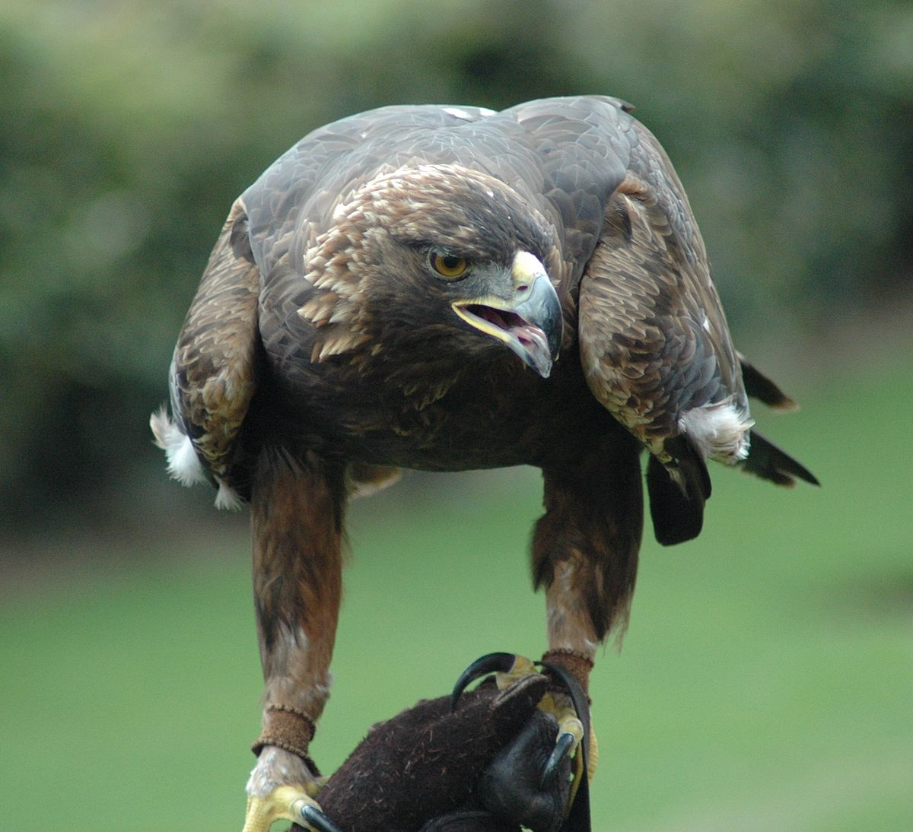

**Write a blog post answering the following questions and detailing the
progress: **

1.  The `xml2` R package can be used to work with xml files. Write a
    function, `current_weather` that accepts a 4-letter airport code
    (KAMW in the URL here:
    <a href="https://w1.weather.gov/xml/current_obs/KAMW.xml" class="uri">https://w1.weather.gov/xml/current_obs/KAMW.xml</a>)
    and returns a data frame with the airport location (station ID,
    latitude, longitude), last update time, and current weather
    information (temperature, weather condition, wind speed and
    direction) at that airport. The `xml2` functions `read_xml`,
    `xml_children`, `xml_name`, and `xml_text` will be useful. Remember
    to handle errors and check inputs, and make sure to return a data
    frame with appropriate data types.

<!-- -->

    library(xml2)
    library(assertthat)
    library(rvest)
    library(tidyverse)
    library(dplyr)

    current_weather <- function(code){
      checkmate::assertCharacter(code)
      
      link <- read_xml(paste0("https://w1.weather.gov/xml/current_obs/",code,".xml"))
      col <- xml_contents(link)%>%xml_name()  
      info <- link %>% xml_children() %>% xml_text
      dataframe <- as.data.frame(matrix(info, ncol  = length(info), byrow = T), stringsAsFactors = F)
      colnames(dataframe) <- col
      data <- dataframe %>% dplyr::select(station_id, latitude, longitude,
                                          observation_time,
                                          temperature_string, weather,wind_mph, wind_dir)
      return(data)
    }
    check <- current_weather("KAMW")
    t(check)

    ##                    [,1]                                      
    ## station_id         "KAMW"                                    
    ## latitude           "41.99056"                                
    ## longitude          "-93.61889"                               
    ## observation_time   "Last Updated on Apr 2 2019, 10:53 am CDT"
    ## temperature_string "39.0 F (3.9 C)"                          
    ## weather            "Mostly Cloudy"                           
    ## wind_mph           "10.4"                                    
    ## wind_dir           "Northwest"

1.  Which HTML tags did you investigate? Describe how to format at least
    3 separate pieces of a document using HTML tags.

I investigated the tags for hyperlink, table and paragraph. The
hyperlink a is used to link from one page to another and href attribute
indicates the link’s destination. The p tag identifies a paragraph. The
table tag defines an HTML table. The tr element identify a table row,
the th element provides a table header, and the td element specifies a
table cell.

There are examples:

Link for my website <a href="https://ganiagadil.github.io/"> My website
</a>

Table for salaries &lt;!DOCTYPE html&gt;
<html>
<head>

</head>
<body>
<table>
<tr>
<th>
Year
</th>
<th>
Salary
</th>
</tr>
<tr>
<td>
2018
</td>
<td>
$50000
</td>
</tr>
<tr>
<td>
2019
</td>
<td>
$60000
</td>
</tr>
</table>
</body>
</html>
Paragraph &lt;!DOCTYPE html&gt;
<html>
<body>

Introduction.

Data analysis.

Conclusion.

</body>
</html>
1.  Compile this Rmarkdown document to HTML, then open the HTML file in
    a web browser. Open the inspector console for your browser
    (Ctrl-Shift-I in Chrome, Ctrl-Shift-C in Firefox) and look at the
    HTML code corresponding to various parts of the document.  
    Answer the following questions:

    -   What types of tags did you find? I found tags for paragraph in
        console section.

    -   How are code chunks formatted in HTML? The R code formatted in
        pre class=“r”.

    -   What differences are there in the HTML markup for R code chunks
        and R output blocks? The main difference is the R code formatted
        in pre class=“r”, but R output is formatted in pre and
        class=“hljs” tag.

2.  In R, the `rvest` package, which is part of the tidyverse, makes it
    (relatively) easy to pull specific pieces from structured documents.
    The `html_nodes` function selects nodes using either xpath or css,
    and additional functions such as `html_attrs`, `html_text`, and
    `html_table` pull information out of the markup text.  Choose a
    Wikipedia page that has at least one image to test the `rvest`
    package out

<!-- -->

    library(tidyverse)
    library(rvest)

    eagle <- read_html("https://en.wikipedia.org/wiki/Golden_eagle")  

    eagle %>% html_nodes("title") %>% html_text()

    ## [1] "Golden eagle - Wikipedia"

    image <- eagle %>%  html_nodes("meta") %>% html_attrs() 

    magick::image_read(image[[7]][[2]])

    eagle %>% html_nodes("table") %>% html_table()

    ## [[1]]
    ##                                                                                    Golden eagle
    ## 1                                                                                              
    ## 2  Adult of the North American subspecies Aquila chrysaetos canadensis   call of a Golden Eagle
    ## 3                                                                           Conservation status
    ## 4                                                                   Least Concern (IUCN 3.1)[1]
    ## 5                                                                     Scientific classification
    ## 6                                                                                      Kingdom:
    ## 7                                                                                       Phylum:
    ## 8                                                                                        Class:
    ## 9                                                                                        Order:
    ## 10                                                                                      Family:
    ## 11                                                                                       Genus:
    ## 12                                                                                     Species:
    ## 13                                                                                Binomial name
    ## 14                                                            Aquila chrysaetos(Linnaeus, 1758)
    ## 15                                                                                   Subspecies
    ## 16                                                                                  6, see text
    ## 17                                                                                             
    ## 18                        Range of A. chrysaetos\n     Breeding      Resident      Non-breeding
    ## 19                                                                                     Synonyms
    ## 20                                   Falco chrysaëtos Linnaeus, 1758Falco fulvus Linnaeus, 1758
    ##                                                                                    Golden eagle
    ## 1                                                                                              
    ## 2  Adult of the North American subspecies Aquila chrysaetos canadensis   call of a Golden Eagle
    ## 3                                                                           Conservation status
    ## 4                                                                   Least Concern (IUCN 3.1)[1]
    ## 5                                                                     Scientific classification
    ## 6                                                                                      Animalia
    ## 7                                                                                      Chordata
    ## 8                                                                                          Aves
    ## 9                                                                               Accipitriformes
    ## 10                                                                                 Accipitridae
    ## 11                                                                                       Aquila
    ## 12                                                                                A. chrysaetos
    ## 13                                                                                Binomial name
    ## 14                                                            Aquila chrysaetos(Linnaeus, 1758)
    ## 15                                                                                   Subspecies
    ## 16                                                                                  6, see text
    ## 17                                                                                             
    ## 18                        Range of A. chrysaetos\n     Breeding      Resident      Non-breeding
    ## 19                                                                                     Synonyms
    ## 20                                   Falco chrysaëtos Linnaeus, 1758Falco fulvus Linnaeus, 1758
    ## 
    ## [[2]]
    ##   X1                                                        X2
    ## 1 NA Wikimedia Commons has media related to Aquila chrysaetos.
    ## 
    ## [[3]]
    ##   X1                                                       X2
    ## 1 NA Wikispecies has information related to Aquila chrysaetos
    ## 
    ## [[4]]
    ##                  X1
    ## 1 Taxon identifiers
    ##                                                                                                                                                                                                                                                                                                                                                                                                                                                                                                                                                                                                                                                                                                  X2
    ## 1 Wikidata: Q41181\nWikispecies: Aquila chrysaetos\nABA: goleag\nADW: Aquila_chrysaetos\nARKive: aquila-chrysaetos\nAvibase: 5F8E7CA845BD413F\nBioLib: 8534\nBirdLife: 22696060\nBTO: GOLEA\nCMS: aquila-chrysaetos\neBird: goleag\nEoL: 10985575\nEPPO: AQUICR\nEUNIS: 894\nEuring: 2960\nFauna Europaea: 96734\nFauna Europaea (new): c33b8c2b-8469-4857-b22a-e4a2d7fe9fbb\nFEIS: aqch\nFossilworks: 94489\nGBIF: 2480506\nGNAB: golden-eagle\nIBC: golden-eagle-aquila-chrysaetos\niNaturalist: 5074\nIRMNG: 10194898\nISC: 93340\nITIS: 175407\nIUCN: 22696060\nNBN: NHMSYS0000530170\nNCBI: 8962\nNeotropical: goleag\nSpecies+: 6150\nTSA: 2112\nWoRMS: 159107\nXeno-canto: Aquila-chrysaetos
    ## 
    ## [[5]]
    ##                  X1                            X2
    ## 1 Authority control GND: 4183017-9\nNDL: 01062678
