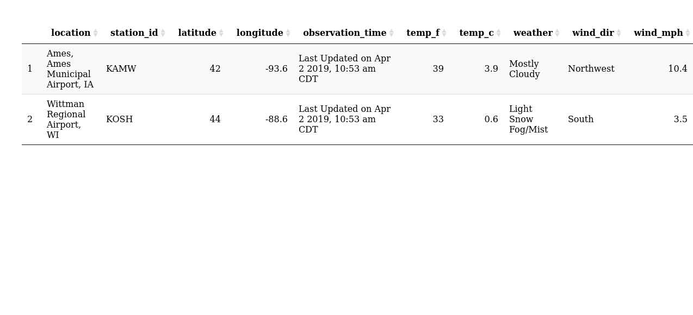

### Question 1

**The `xml2` R package can be used to work with xml files. Write a
function, `current_weather` that accepts a 4-letter airport code (KAMW
in the URL here:
<a href="https://w1.weather.gov/xml/current_obs/KAMW.xml" class="uri">https://w1.weather.gov/xml/current_obs/KAMW.xml</a>)
and returns a data frame with the airport location (station ID,
latitude, longitude), last update time, and current weather information
(temperature, weather condition, wind speed and direction) at that
airport. The `xml2` functions `read_xml`, `xml_children`, `xml_name`,
and `xml_text` will be useful. Remember to handle errors and check
inputs, and make sure to return a data frame with appropriate data
types.**

------------------------------------------------------------------------

#### current\_weather Function

I wrote the function below to access the xml weather data from an
airport given a 4-letter airport code. It returns a data frame with the
following variables: location, station\_id, latitude, longitude,
observation\_time, temp\_f, temp\_c, weather, wind\_dir, and wind\_mph

    current_weather <- function(code){
      
      # Load dplyr
      library(dplyr, warn.conflicts = FALSE)
      
      # Check that the code is a character with four letters
      checkmate::expect_character(code, len = 1)
      checkmate::expect_integer(nchar(code), lower = 4, upper = 4, 
                                info = "This input code must be four letters.")
      
      # Create the website link using the input code
      link <- paste0("https://w1.weather.gov/xml/current_obs/", code, ".xml")
      
      # Grab the xml code
      x <- xml2::read_xml(link)

      # Grab the element names from the xml
      names <- x %>%
        xml2::xml_children() %>%
        xml2::xml_name()
      
      # Grab the elements from the xml
      values <- x %>%
        xml2::xml_children() %>%
        xml2::xml_text()
      
      # Put the names and elements in a data frame, select the ones of interest,
      # turn the names into the variables, and set the variables to the appropriate
      # format
      df <- data.frame(names, values) %>%
        filter(names %in% c("location", "station_id", "latitude", "longitude",
                            "observation_time", "temp_f", "temp_c", "weather",
                            "wind_dir", "wind_mph")) %>%
        tidyr::spread(key = names, value = values) %>%
        select(location, station_id, latitude, longitude, observation_time, 
               temp_f, temp_c, weather, wind_dir, wind_mph) %>%
        mutate(location = as.character(location),
               station_id = as.character(station_id),
               latitude = round(as.numeric(as.character(latitude)), 1),
               longitude = round(as.numeric(as.character(longitude)), 1),
               observation_time = as.character(observation_time),
               temp_f = as.numeric(as.character(temp_f)),
               temp_c = as.numeric(as.character(temp_c)),
               weather = factor(weather),
               wind_dir = factor(wind_dir),
               wind_mph = as.numeric(as.character(wind_mph)))

      # Return the data frame
      return(df)
      
    }

 

#### Applying the Function

Below I use the function to obtain the weather from Ames, IA and
Oshkosh, WI. I output the data in a DT table.

    # Load the tidyverse
    library(tidyverse)

    # Obtain the data and print in a dt table
    current_weather("KAMW") %>%
      bind_rows(current_weather("KOSH")) %>% 
      DT::datatable(options = list(dom = 't'))

 

### Question 2

**Which HTML tags did you investigate? Describe how to format at least 3
separate pieces of a document using HTML tags.**

------------------------------------------------------------------------

I looked into the tags for body, headings, and paragraphs. I’ve seen the
tags for headings and paragraphs before, but I did not know what they
were for. The body tag was helpful to learn about, because it defines
the content that will appear on the webpage. The headings allow you to
specify section headers, and you can list a number behind the letter h
in the tag to define the level of the heading. While reading about
headings, I learned that hr can be used to put a horizontal line break
on the webpage. The tag for paragraphs is p, but spaces will not be
preserved when you use this tag. You can use pr to preserve the spacing.

 

### Question 3

**Compile this Rmarkdown document to HTML, then open the HTML file in a
web browser. Open the inspector console for your browser (Ctrl-Shift-I
in Chrome, Ctrl-Shift-C in Firefox) and look at the HTML code
corresponding to various parts of the document. Answer the following
questions: **

    - What types of tags did you find?

    - How are code chunks formatted in HTML?

    - What differences are there in the HTML markup for R code chunks and R output blocks?**

------------------------------------------------------------------------

I saw tags for headings and paragraphs. I also saw tags for text
formatting such as code for `code` formatted text and href for links.
The code chunks get formatted using a pre tag with a class set to “r”.
When I looked at the HTML markup for R code chunks, the tags of span are
used to include the code and classes are used to specify what the
characters of code are meant to do.

 

### Question 4

**In R, the `rvest` package, which is part of the tidyverse, makes it
(relatively) easy to pull specific pieces from structured documents. The
`html_nodes` function selects nodes using either xpath or css, and
additional functions such as `html_attrs`, `html_text`, and `html_table`
pull information out of the markup text. Choose a Wikipedia page that
has at least one image to test the `rvest` package out.**

------------------------------------------------------------------------

I used the `rvest` package to grab images of red pandas from the
Wikipedia page red pandas. :)

    # Load the rvest library
    library(rvest)

    # Obtain the images of red pandas
    redpandas <- read_html("https://en.wikipedia.org/wiki/Red_panda") %>%
      html_nodes(".image img") %>%
      html_attr("src")

