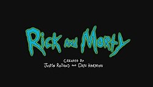

### Background

The internet may not be [a series of
tubes](https://en.wikipedia.org/wiki/Series_of_tubes), but it is made up
of a number of different programming and markup languages. It is useful
to develop a basic vocabulary and understanding of these languages
before attempting to interact with (messy) data stored on the internet.

&lt;A&gt;: Like &lt;/a&gt;this.&nbsp;"

As the reading material for this week, you are asked to read through a
set of websites on XML and HTML and navigating through them:

-   **XML (eXtensible Markup Language):** XML is a generic markup
    framework. Many different common file types are based on or related
    to XML structure (for instance, .docx, .xlsx, .html)   Read the
    following sections of w3schools.com’s Introduction to XML:

    -   [XML Introduction](https://www.w3schools.com/xml/xml_whatis.asp)
    -   [XML How to Use](https://www.w3schools.com/xml/xml_usedfor.asp)
    -   [XML Tree](https://www.w3schools.com/xml/xml_tree.asp)
    -   [XML Syntax](https://www.w3schools.com/xml/xml_syntax.asp)
    -   [XML Elements](https://www.w3schools.com/xml/xml_elements.asp)
    -   [XML
        Attributes](https://www.w3schools.com/xml/xml_attributes.asp)

-   **HTML (HyperText Markup Language):** HTML focuses on the display of
    information in a document format. XML is a much more general
    framework, but most of the concepts (tags, attributes, elements)
    apply directly to HTML. Open up the [w3schools HTML
    page](https://www.w3schools.com/html/default.asp) and read the
    introduction, then look through a few topics in the tutorial that
    interest you.

-   **Navigation: HTML, CSS, XPATH, and more:** In many situations, it
    is helpful to be able to pick out specific parts of an HTML or XML
    file - for example, a table with useful data. CSS (Cascading Style
    Sheets) Selectors and XPATH are two methods commonly used to
    identify specific nodes in HTML or XML documents.

    -   [XPATH Syntax](https://www.w3schools.com/xml/xpath_syntax.asp)
    -   [CSS Selector
        Syntax](https://www.w3schools.com/cssref/css_selectors.asp)

**Write a blog post answering the following questions and detailing the
progress: **

1.  The `xml2` R package can be used to work with xml files. Write a
    function, `current_weather` that accepts a 4-letter airport code
    (KAMW in the URL here:
    <a href="https://w1.weather.gov/xml/current_obs/KAMW.xml" class="uri">https://w1.weather.gov/xml/current_obs/KAMW.xml</a>)
    and returns a data frame with the airport location (station ID,
    latitude, longitude), last update time, and current weather
    information (temperature, weather condition, wind speed and
    direction) at that airport. The `xml2` functions `read_xml`,
    `xml_children`, `xml_name`, and `xml_text` will be useful. Remember
    to handle errors and check inputs, and make sure to return a data
    frame with appropriate data types.

<!-- -->

    library(xml2)
    library(tidyverse) 
    library(checkmate)
    current_weather <- function(code){
      checkCharacter(code)
      children<-read_xml(paste0("https://w1.weather.gov/xml/current_obs/", code,".xml")) %>%       xml_children() 
      info<-as.data.frame(t(xml_text(children)[c(7:10,12,13,18,20)]))
      colnames(info)<-xml_name(children)[c(7:10,12,13,18,20)]
      info<-info %>% 
        mutate_if(is.factor,as.character) %>% 
        mutate(latitude=as.double(latitude),longitude=as.double(longitude),wind_mph=as.numeric(wind_mph))
      return(info)
    }
    current_weather("KAMW")

    ##   station_id latitude longitude                         observation_time
    ## 1       KAMW 41.99056 -93.61889 Last Updated on Apr 2 2019, 10:53 am CDT
    ##         weather temperature_string  wind_dir wind_mph
    ## 1 Mostly Cloudy     39.0 F (3.9 C) Northwest     10.4

1.  Which HTML tags did you investigate? Describe how to format at least
    3 separate pieces of a document using HTML tags.
    images,links,formatting formatting: elements: <b> - Bold text
    <strong> - Important text <i> - Italic text <em> - Emphasized text
    <mark> - Marked text <small> - Small text <del> - Deleted text
    <ins> - Inserted text  - Subscript text  - Superscript
    text images: You can use the style attribute to specify the width
    and height of an image. Alternatively, you can use the width and
    height attributes. links: You can change the default colors of
    links, by using CSS.

2.  Compile this Rmarkdown document to HTML, then open the HTML file in
    a web browser. Open the inspector console for your browser
    (Ctrl-Shift-I in Chrome, Ctrl-Shift-C in Firefox) and look at the
    HTML code corresponding to various parts of the document.  
    Answer the following questions:

    -   What types of tags did you find? \#background &gt; div &gt;
        p &gt; a &gt; img

    -   How are code chunks formatted in HTML? pre class=“r” code
        class=“hljs” codes </code>

    -   What differences are there in the HTML markup for R code chunks
        and R output blocks?
        <pre>
        == $0 is infront of output block

3.  In R, the `rvest` package, which is part of the tidyverse, makes it
    (relatively) easy to pull specific pieces from structured documents.
    The `html_nodes` function selects nodes using either xpath or css,
    and additional functions such as `html_attrs`, `html_text`, and
    `html_table` pull information out of the markup text.  Choose a
    Wikipedia page that has at least one image to test the `rvest`
    package out

<!-- -->

    library(rvest)
    rick<-read_html("https://en.wikipedia.org/wiki/Rick_and_Morty")
      html_nodes(rick,"table tbody td a img")[[1]] %>% 
      xml_attr(attr="src")%>%
      paste0("https:",.) %>%
      magick::image_read()

