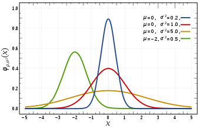

**Write a blog post answering the following questions and detailing the
progress: ** 1. The `xml2` R package can be used to work with xml files.
Write a function, `current_weather` that accepts a 4-letter airport code
(KAMW in the URL here:
<a href="https://w1.weather.gov/xml/current_obs/KAMW.xml" class="uri">https://w1.weather.gov/xml/current_obs/KAMW.xml</a>)
and returns a data frame with the airport location (station ID,
latitude, longitude), last update time, and current weather information
(temperature, weather condition, wind speed and direction) at that
airport. The `xml2` functions `read_xml`, `xml_children`, `xml_name`,
and `xml_text` will be useful. Remember to handle errors and check
inputs, and make sure to return a data frame with appropriate data
types.

    current_weather <- function(code){
      if(!is.character(code)){
        stop("\"code\" must be a character string ")}
      if(nchar(code)!=4){
        stop("The input string must have length of 4")}
      if(grepl("^[[:lower:]]+$", code)){
        stop("The 4-letter input string must be of uppercase")
      }
      airport_url <- paste0("https://w1.weather.gov/xml/current_obs/",code,".xml",sep="")
      if(!RCurl::url.exists(airport_url,useragent="curl/7.39.0 Rcurl/1.95.4.5")){
        stop("The url does not exist, please try another 4-letter airport code")
      }
      airport_info <- read_xml(airport_url) %>% 
        xml_children()
      airport_df <- matrix(nrow = 0, ncol = length(xml_name(airport_info))) %>% data.frame()
      colnames(airport_df) <- xml_name(airport_info)
      airport_df[1,] <- xml_text(airport_info)
      output <- airport_df %>% select(station_id, latitude, longitude, observation_time, weather, temperature_string, wind_string)
      output$latitude <- output$latitude %>% as.numeric
      output$longitude <- output$longitude %>% as.numeric
      return(output)
    }
    current_weather("KAMW")

    ##   station_id latitude longitude                         observation_time
    ## 1       KAMW 41.99056 -93.61889 Last Updated on Apr 2 2019, 10:53 am CDT
    ##         weather temperature_string                  wind_string
    ## 1 Mostly Cloudy     39.0 F (3.9 C) Northwest at 10.4 MPH (9 KT)

1.  Which HTML tags did you investigate? Describe how to format at least
    3 separate pieces of a document using HTML tags.

I investigated `<html>`, `
`, `<h1>`, `<body>`, `<style>`, `<image>`,
etc.

We can use an internal CSS to format separate piece of a document. An
internal CSS is defined in the `<head>` section of an HTML page, within
a `<style>` element. For example if we want to format the document
background, the headings and the paragraph. Then we can use:

&lt;!DOCTYPE html&gt;

&lt;html&gt;

&lt;head&gt;

&lt;style&gt;

body {background-color: powderblue;}

h1 {color: blue; font-family:verdana; font-size: 260%}

p {color: red; font-family: courier; font-size: 130%;

border: 1px solid green}

&lt;/style&gt;

&lt;/head&gt;

&lt;body&gt;

&lt;/body&gt;

&lt;/html&gt;

1.  Compile this Rmarkdown document to HTML, then open the HTML file in
    a web browser. Open the inspector console for your browser
    (Ctrl-Shift-I in Chrome, Ctrl-Shift-C in Firefox) and look at the
    HTML code corresponding to various parts of the document.  
    Answer the following questions:
    -   What types of tags did you find?

    I found tags like: `<head>`, `<body>`, `
`, `<style>`, `
`,
    `<script>`, `<code>`, etc.
    -   How are code chunks formatted in HTML?

    The format is `<pre class="r">`
    -   What differences are there in the HTML markup for R code chunks
        and R output blocks?

    The output block doesn’t follow `<pre class="r">`, and it doesn’t
    have the tag `` which I think it’s used for codes formatting.

2.  In R, the `rvest` package, which is part of the tidyverse, makes it
    (relatively) easy to pull specific pieces from structured documents.
    The `html_nodes` function selects nodes using either xpath or css,
    and additional functions such as `html_attrs`, `html_text`, and
    `html_table` pull information out of the markup text.  Choose a
    Wikipedia page that has at least one image to test the `rvest`
    package out Remember, just because you have the HTML file doesn’t
    mean you should commit it to your git repository!!! Delete the HTML
    file now if you’re going to be tempted to accidentally commit and
    push it.

<!-- -->

    webpage <- read_html("https://en.wikipedia.org/wiki/Normal_distribution")

    (webpage_title <- webpage %>% html_nodes("h1") %>% html_text)

    ## [1] "Normal distribution"

    image_url <- webpage %>% 
      html_nodes("img") %>% 
      html_attr(name = "src") %>% 
      magrittr::extract2(1) 
    magick::image_read(paste0("https:",image_url))

---------------------------------------------------------------------
