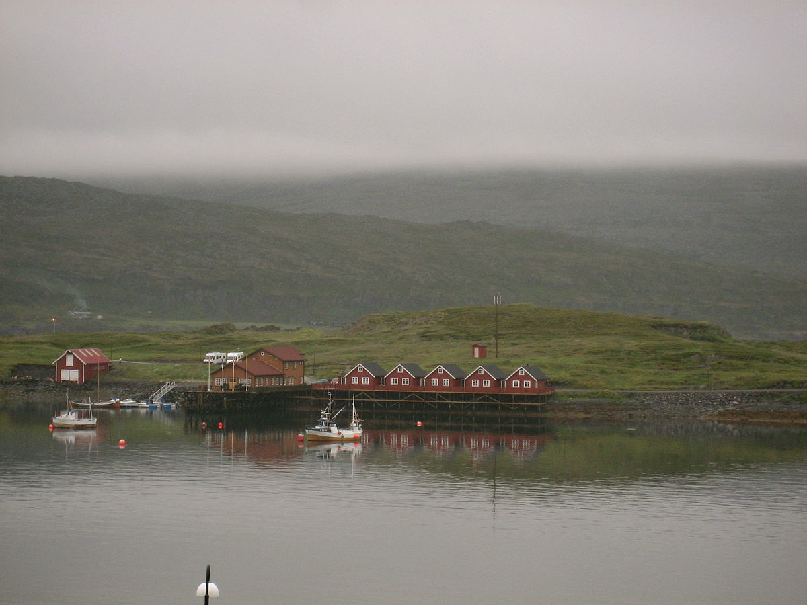

<<<<<<< HEAD
**Write a blog post answering the following questions and detailing the
progress: ** 1. The `xml2` R package can be used to work with xml files.
Write a function, `current_weather` that accepts a 4-letter airport code
(KAMW in the URL here:
<a href="https://w1.weather.gov/xml/current_obs/KAMW.xml" class="uri">https://w1.weather.gov/xml/current_obs/KAMW.xml</a>)
and returns a data frame with the airport location (station ID,
latitude, longitude), last update time, and current weather information
(temperature, weather condition, wind speed and direction) at that
airport. The `xml2` functions `read_xml`, `xml_children`, `xml_name`,
and `xml_text` will be useful. Remember to handle errors and check
inputs, and make sure to return a data frame with appropriate data
types.

    library(tidyverse)
    library(xml2)
    current_weather <- function(airport){
      
      checkmate::assertCharacter(airport)
      ## read the data and select corresponding elements
      air <- read_xml(paste0("https://w1.weather.gov/xml/current_obs/", airport, ".xml" ))
      dataname <- air %>% xml_children() %>% xml_name() %>% .[c(7, 8, 9, 10, 14, 15, 20, 18)]
      seldata <- air %>% xml_children() %>% xml_text %>% .[c(7, 8, 9, 10, 14, 15, 20, 18)]
      
      ## construct a data.frame
      dat <- as.data.frame(matrix(seldata, ncol = length(seldata)), stringsAsFactors = F)
      colnames(dat) <- dataname
      
      checkmate::check_data_frame(data) # check whether the output is a data.frame
      return(dat)
    }
    current_weather("KAMW")

    ##   station_id latitude longitude                         observation_time
    ## 1       KAMW 41.99056 -93.61889 Last Updated on Apr 2 2019, 10:53 am CDT
    ##   temp_f temp_c wind_mph  wind_dir
    ## 1   39.0    3.9     10.4 Northwest

    current_weather("KCNC") 

    ##   station_id latitude longitude                         observation_time
    ## 1       KCNC 41.03333 -93.36667 Last Updated on Apr 2 2019, 10:55 am CDT
    ##   temp_f temp_c wind_mph  wind_dir
    ## 1   37.0    3.0     11.5 Northwest

1.  Which HTML tags did you investigate? Describe how to format at least
    3 separate pieces of a document using HTML tags.

Title, Image and Document

    Title: <p><abbr title="World Health Organization">WHO</abbr>
    Image:   
    Document:  <H1>This is a top level heading</H1> Here is some text.
    <H2>Second level heading</H2> Here is some more text.

1.  Compile this Rmarkdown document to HTML, then open the HTML file in
    a web browser. Open the inspector console for your browser
    (Ctrl-Shift-I in Chrome, Ctrl-Shift-C in Firefox) and look at the
    HTML code corresponding to various parts of the document. <br>
    Answer the following questions:
    -   What types of tags did you find? Background color, color ,
        font-size

    -   How are code chunks formatted in HTML?

    <pre class="r">
    -   What differences are there in the HTML markup for R code chunks
        and R output blocks? Different tags.

2.  In R, the `rvest` package, which is part of the tidyverse, makes it
    (relatively) easy to pull specific pieces from structured documents.
    The `html_nodes` function selects nodes using either xpath or css,
    and additional functions such as `html_attrs`, `html_text`, and
    `html_table` pull information out of the markup text.<br> Choose a
    Wikipedia page that has at least one image to test the `rvest`
    package out Remember, just because you have the HTML file doesn’t
    mean you should commit it to your git repository!!! Delete the HTML
    file now if you’re going to be tempted to accidentally commit and
    push it.

<!-- -->

    library(tidyverse)
    library(rvest)
    Overcast <- xml2::read_html("https://en.wikipedia.org/wiki/Overcast")
    Overcast %>% 
      html_nodes("title") %>%
      html_text()

    ## [1] "Overcast - Wikipedia"

    #To find and show the image file in the wiki link above 
    image.url <- Overcast %>% 
      html_nodes("meta") %>% 
      html_attrs()
    magick::image_read(as.vector(image.url[[7]][2]))



    #Three small tables near REFERENCE sections
    Overcast %>% html_nodes("table") 

    ## {xml_nodeset (3)}
    ## [1] <table role="presentation" class="mbox-small plainlinks sistersitebo ...
    ## [2] <table role="presentation" class="mbox-small plainlinks sistersitebo ...
    ## [3] <table class="metadata plainlinks stub" role="presentation" style="b ...

    Overcast %>% html_table()

    ## [[1]]
    ##   X1                                               X2
    ## 1 NA Wikimedia Commons has media related to Overcast.
    ## 
    ## [[2]]
    ##   X1                                                   X2
    ## 1 NA Look up overcast in Wiktionary, the free dictionary.
    ## 
    ## [[3]]
    ##   X1
    ## 1 NA
    ##                                                                                                   X2
    ## 1 This climatology/meteorology–related article is a stub. You can help Wikipedia by expanding it.vte
=======
---
title: "A Series of Tubes..."
author: "Jessica Kueon"
topic: "09"
layout: post
root: ../../../
output: 
  html_document: 
    css: extra.css
---


**Write a blog post answering the following questions and detailing the progress: **
1. The `xml2` R package can be used to work with xml files. Write a function, `current_weather` that accepts a 4-letter airport code (KAMW in the URL here: https://w1.weather.gov/xml/current_obs/KAMW.xml) and returns a data frame with the airport location (station ID, latitude, longitude), last update time, and current weather information (temperature, weather condition, wind speed and direction) at that airport. The `xml2` functions `read_xml`, `xml_children`, `xml_name`, and `xml_text` will be useful. Remember to handle errors and check inputs, and make sure to return a data frame with appropriate data types. 


```r
library(tidyverse)
library(xml2)
current_weather <- function(airport){
  
  checkmate::assertCharacter(airport)
  ## read the data and select corresponding elements
  air <- read_xml(paste0("https://w1.weather.gov/xml/current_obs/", airport, ".xml" ))
  dataname <- air %>% xml_children() %>% xml_name() %>% .[c(7, 8, 9, 10, 14, 15, 20, 18)]
  seldata <- air %>% xml_children() %>% xml_text %>% .[c(7, 8, 9, 10, 14, 15, 20, 18)]
  
  ## construct a data.frame
  dat <- as.data.frame(matrix(seldata, ncol = length(seldata)), stringsAsFactors = F)
  colnames(dat) <- dataname
  
  checkmate::check_data_frame(data) # check whether the output is a data.frame
  return(dat)
}
current_weather("KAMW")
```

```
##   station_id latitude longitude                         observation_time
## 1       KAMW 41.99056 -93.61889 Last Updated on Apr 3 2019, 12:53 pm CDT
##   temp_f temp_c wind_mph wind_dir
## 1   54.0   12.2      9.2    South
```

```r
current_weather("KCNC") 
```

```
##   station_id latitude longitude                         observation_time
## 1       KCNC 41.03333 -93.36667 Last Updated on Apr 3 2019, 12:55 pm CDT
##   temp_f temp_c wind_mph wind_dir
## 1   50.0   10.0     13.8    South
```


2. Which HTML tags did you investigate? Describe how to format at least 3 separate pieces of a document using HTML tags.


Title, Image and Document
````
Title: <p><abbr title="World Health Organization">WHO</abbr>
Image:   
Document:  <H1>This is a top level heading</H1> Here is some text.
<H2>Second level heading</H2> Here is some more text.
````

3. Compile this Rmarkdown document to HTML, then open the HTML file in a web browser. Open the inspector console for your browser (Ctrl-Shift-I in Chrome, Ctrl-Shift-C in Firefox) and look at the HTML code corresponding to various parts of the document. <br>
Answer the following questions:
    - What types of tags did you find? 
Background color, color , font-size    
  
    - How are code chunks formatted in HTML?
  
   <pre class="r">
   
    - What differences are there in the HTML markup for R code chunks and R output blocks?
  Different tags.
  
    
4. In R, the `rvest` package, which is part of the tidyverse, makes it (relatively) easy to pull specific pieces from structured documents. The `html_nodes` function selects nodes using either xpath or css, and additional functions such as `html_attrs`, `html_text`, and `html_table` pull information out of the markup text.<br>
Choose a Wikipedia page that has at least one image to test the `rvest` package out
Remember, just because you have the HTML file doesn't mean you should commit it to your git repository!!! Delete the HTML file now if you're going to be tempted to accidentally commit and push it.


```r
library(tidyverse)
library(rvest)
Overcast <- xml2::read_html("https://en.wikipedia.org/wiki/Overcast")
Overcast %>% 
  html_nodes("title") %>%
  html_text()
```

```
## [1] "Overcast - Wikipedia"
```

```r
#To find and show the image file in the wiki link above 
image.url <- Overcast %>% 
  html_nodes("meta") %>% 
  html_attrs()
magick::image_read(as.vector(image.url[[7]][2]))
```


```r
#Three small tables near REFERENCE sections
Overcast %>% html_nodes("table") 
```

```
## {xml_nodeset (3)}
## [1] <table role="presentation" class="mbox-small plainlinks sistersitebo ...
## [2] <table role="presentation" class="mbox-small plainlinks sistersitebo ...
## [3] <table class="metadata plainlinks stub" role="presentation" style="b ...
```

```r
Overcast %>% html_table()
```

```
## [[1]]
##   X1                                               X2
## 1 NA Wikimedia Commons has media related to Overcast.
## 
## [[2]]
##   X1                                                   X2
## 1 NA Look up overcast in Wiktionary, the free dictionary.
## 
## [[3]]
##   X1
## 1 NA
##                                                                                                   X2
## 1 This climatology/meteorology–related article is a stub. You can help Wikipedia by expanding it.vte
```
>>>>>>> blog 9 posts up
