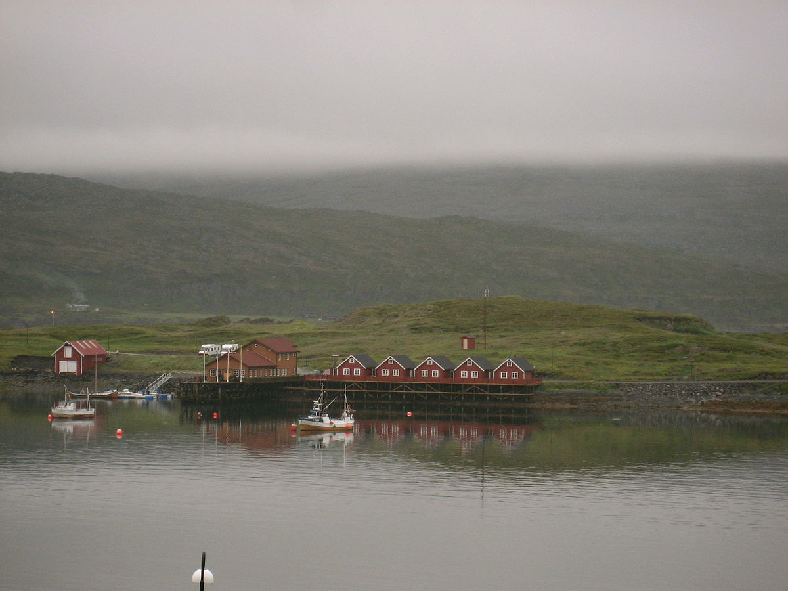

\#\#\#\#\#1. The `xml2` R package can be used to work with xml files.
Write a function, `current_weather` that accepts a 4-letter airport code
(KAMW in the URL here:
<a href="https://w1.weather.gov/xml/current_obs/KAMW.xml" class="uri">https://w1.weather.gov/xml/current_obs/KAMW.xml</a>)
and returns a data frame with the airport location (station ID,
latitude, longitude), last update time, and current weather information
(temperature, weather condition, wind speed and direction) at that
airport. The `xml2` functions `read_xml`, `xml_children`, `xml_name`,
and `xml_text` will be useful. Remember to handle errors and check
inputs, and make sure to return a data frame with appropriate data
types.

    library(xml2)
    airport.code <- "KAMW"

    current_weather <- function(airport.code.4.digit){

      URL <- paste("https://w1.weather.gov/xml/current_obs/", airport.code.4.digit, ".xml", sep="")
      dat <- read_xml(URL)

    want.to.find <- c(c("station_id", 
                        "latitude",
                        "longitude",
                        "observation_time",
                        "temperature_string",
                        "weather",
                        "wind_string"))

      no <- length(want.to.find)
      i <- 0
      output <- 1:no
      repeat{
        i <- i + 1
        output[i] <- xml_text(xml_find_all(dat, paste(".//", want.to.find[i], sep="")))
        if(i == no) break
      }

    res <- as.data.frame(t(output))
    colnames(res) <- c("station ID", 
                       "latitude", 
                       "longitude", 
                       "last update time", 
                       "temperature", 
                       "weather condition", 
                       "wind speed and direction")

    if(checkmate::checkDataFrame(res)==F) stop("Your output is not a data frame")
    return(res)

    }
    current_weather("KAMW")

    ##   station ID latitude longitude                         last update time
    ## 1       KAMW 41.99056 -93.61889 Last Updated on Apr 2 2019, 10:53 am CDT
    ##      temperature weather condition     wind speed and direction
    ## 1 39.0 F (3.9 C)     Mostly Cloudy Northwest at 10.4 MPH (9 KT)

\#\#\#\#\#2. Which HTML tags did you investigate? Describe how to format
at least 3 separate pieces of a document using HTML tags.

-   The entire background color can be set as lightyellow color in the
    “body” tag’s style. In addition, the courier font can be applied for
    the first heading. Lastly, in one paragraph, marking some words with
    yellow block is available.

-   This is my example:

&lt;!DOCTYPE html&gt;
<html>
<head>
<title>
Page Title
</title>
</head>
<body style="background-color:lightyellow;">
<h1 style="font-family:courier;">
<i>Section 1</i>
</h1>

This text is <mark>NOT</mark> emphasized.

<h3>
Subsection 1.1
</h3>

My <b>first</b> paragraph.

My 2nd paragraph.

<h1 style="color:blue;">
<i>Section 2</i>
</h1>

<em>This text is <mark>emphasized.</mark></em>

</body>
</html>
\#\#\#\#\#3. Compile this Rmarkdown document to HTML, then open the HTML
file in a web browser. Open the inspector console for your browser
(Ctrl-Shift-I in Chrome, Ctrl-Shift-C in Firefox) and look at the HTML
code corresponding to various parts of the document. Answer the
following questions:

-   What types of tags did you find? html, head, body, div, style, p,
    pre ,script, code, span, and so on

-   How are code chunks formatted in HTML? tag: pre class = “r” tag:
    code class = “hljs”

    display: block;  
    padding: 9.5px;  
    margin: 0 0 10px;  
    font-size: 13px;  
    line-height: 1.42857143;  
    color: \#333;  
    word-break: break-all;  
    word-wrap: break-word;  
    background-color: \#f5f5f5;  
    border: 1px solid \#ccc;  
    border-radius: 4px;

-   What differences are there in the HTML markup for R code chunks and
    R output blocks?

    The “span” tag is used to group inline-elements in a document for R
    code chunks while the R output in the R output blocks is treated as
    a text. In particular, in R code chunks, the “span” tag is used to
    group numbers, user defined R function name as keywords, and
    character strings within quotes as strings while the others are
    considered a text.

\#\#\#\#\#4. In R, the `rvest` package, which is part of the tidyverse,
makes it (relatively) easy to pull specific pieces from structured
documents. The `html_nodes` function selects nodes using either xpath or
css, and additional functions such as `html_attrs`, `html_text`, and
`html_table` pull information out of the markup text. Choose a Wikipedia
page that has at least one image to test the `rvest` package out

    library(tidyverse)
    library(rvest)
    Overcast <- xml2::read_html("https://en.wikipedia.org/wiki/Overcast")

    Overcast %>% 
      html_nodes("title") %>%
      html_text()

    ## [1] "Overcast - Wikipedia"

    #To find and show the image file in the wiki link above 
    image.url <- Overcast %>% 
      html_nodes("meta") %>% 
      html_attrs()
    magick::image_read(as.vector(image.url[[7]][2]))

    #Three small tables near REFERENCE sections
    Overcast %>% html_nodes("table") 

    ## {xml_nodeset (3)}
    ## [1] <table role="presentation" class="mbox-small plainlinks sistersitebo ...
    ## [2] <table role="presentation" class="mbox-small plainlinks sistersitebo ...
    ## [3] <table class="metadata plainlinks stub" role="presentation" style="b ...

    Overcast %>% html_table()

    ## [[1]]
    ##   X1                                               X2
    ## 1 NA Wikimedia Commons has media related to Overcast.
    ## 
    ## [[2]]
    ##   X1                                                   X2
    ## 1 NA Look up overcast in Wiktionary, the free dictionary.
    ## 
    ## [[3]]
    ##   X1
    ## 1 NA
    ##                                                                                                   X2
    ## 1 This climatology/meteorology–related article is a stub. You can help Wikipedia by expanding it.vte
