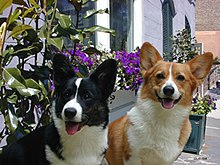

<<<<<<< HEAD
1.  **The xml2 R package can be used to work with xml files. Write a
    function, current\_weather that accepts a 4-letter airport code
    (KAMW in the URL here:
    <a href="https://w1.weather.gov/xml/current_obs/KAMW.xml" class="uri">https://w1.weather.gov/xml/current_obs/KAMW.xml</a>)
    and returns a data frame with the airport location (station ID,
    latitude, longitude), last update time, and current weather
    information (temperature, weather condition, wind speed and
    direction) at that airport. The xml2 functions read\_xml,
    xml\_children, xml\_name, and xml\_text will be useful. Remember to
    handle errors and check inputs, and make sure to return a data frame
    with appropriate data types.**

<!-- -->

    library(tidyverse)
    library(xml2)
    current_weather <- function(station_ID) {
      #checkin the correct input
      checkmate::assertCharacter(station_ID)
      #reading the data
      url <-paste0("https://w1.weather.gov/xml/current_obs/",station_ID,".xml")
      st_name <- read_xml(url) %>% xml_children() %>% xml_name()
      st_info <- read_xml(url) %>% xml_children() %>% xml_text()
      
      out <-data.frame(row.names = st_name[c(6:10, 12, 16)], st_info[c(6:10, 12, 16)])
      #check if the output is a data frame
      checkmate::assertDataFrame(out, types = c("numeric", "factor"))
      
      return(out)

    }

    current_weather("KAMW")

    ##                                   st_info.c.6.10..12..16..
    ## location                  Ames, Ames Municipal Airport, IA
    ## station_id                                            KAMW
    ## latitude                                          41.99056
    ## longitude                                        -93.61889
    ## observation_time  Last Updated on Apr 2 2019, 10:53 am CDT
    ## weather                                      Mostly Cloudy
    ## relative_humidity                                       76

    current_weather("KLAX")

    ##                                             st_info.c.6.10..12..16..
    ## location          Los Angeles, Los Angeles International Airport, CA
    ## station_id                                                      KLAX
    ## latitude                                                    33.93806
    ## longitude                                                 -118.38889
    ## observation_time             Last Updated on Apr 2 2019, 8:53 am PDT
    ## weather                                                Mostly Cloudy
    ## relative_humidity                                                 73

2.**Which HTML tags did you investigate? Describe how to format at least
3 separate pieces of a document using HTML tags.**

    body:
    <body>

    <h1 style="color:red;">This is a Red Heading</h1>

    </body>

    heading: 
    <head>
      <link rel="stylesheet" href="styles.css">
    </head>

    background color:
    body {
      background-color: powderblue;
    }
    h1 {
      color: blue;
    }
    p {
      color: red;
    }

    Images:
    <h2>HTML Image</h2>
    

1.  

**What types of tags did you find?**

I have found
<head>
and
<body>
as main tags with a few other tags such as
<div>
,
<div id>
,
<div class>
,
<script>
,etc.

**How are code chunks formatted in HTML?** The chunks are formatted like
a tree which starts with the root up to the leaves.

**What differences are there in the HTML markup for R code chunks and R
output blocks?.** Output blocks follow the default class in a way that
the tags and text are pre specified.

4.**In R, the rvest package, which is part of the tidyverse, makes it
(relatively) easy to pull specific pieces from structured documents. The
html\_nodes function selects nodes using either xpath or css, and
additional functions such as html\_attrs, html\_text, and html\_table
pull information out of the markup text. Choose a Wikipedia page that
has at least one image to test the rvest package out**

    library(rvest)

    url<-"https://en.wikipedia.org/wiki/Welsh_Corgi"
    html <- read_html(url)
    img<-html_nodes(html, ".thumbimage") %>%  html_attr("src") 
    magick::image_read(paste0("https:", img))


=======
---
title: "A Series of Tubes..."
author: "Amin Shirazi"
topic: "09"
layout: post
root: ../../../
---

1. **The xml2 R package can be used to work with xml files. Write a function, current_weather that accepts a 4-letter airport code (KAMW in the URL here: https://w1.weather.gov/xml/current_obs/KAMW.xml) and returns a data frame with the airport location (station ID, latitude, longitude), last update time, and current weather information (temperature, weather condition, wind speed and direction) at that airport. The xml2 functions read_xml, xml_children, xml_name, and xml_text will be useful. Remember to handle errors and check inputs, and make sure to return a data frame with appropriate data types.**


```r
library(tidyverse)
library(xml2)
current_weather <- function(station_ID) {
  #checkin the correct input
  checkmate::assertCharacter(station_ID)
  #reading the data
  url <-paste0("https://w1.weather.gov/xml/current_obs/",station_ID,".xml")
  st_name <- read_xml(url) %>% xml_children() %>% xml_name()
  st_info <- read_xml(url) %>% xml_children() %>% xml_text()
  
  out <-data.frame(row.names = st_name[c(6:10, 12, 16)], st_info[c(6:10, 12, 16)])
  #check if the output is a data frame
  checkmate::assertDataFrame(out, types = c("numeric", "factor"))
  
  return(out)

}

current_weather("KAMW")
```

```
##                                   st_info.c.6.10..12..16..
## location                  Ames, Ames Municipal Airport, IA
## station_id                                            KAMW
## latitude                                          41.99056
## longitude                                        -93.61889
## observation_time  Last Updated on Apr 3 2019, 12:53 pm CDT
## weather                                           Overcast
## relative_humidity                                       45
```

```r
current_weather("KLAX")
```

```
##                                             st_info.c.6.10..12..16..
## location          Los Angeles, Los Angeles International Airport, CA
## station_id                                                      KLAX
## latitude                                                    33.93806
## longitude                                                 -118.38889
## observation_time            Last Updated on Apr 3 2019, 10:53 am PDT
## weather                                                Mostly Cloudy
## relative_humidity                                                 67
```

2.**Which HTML tags did you investigate? Describe how to format at least 3 separate pieces of a document using HTML tags.**
````
body:
<body>

<h1 style="color:red;">This is a Red Heading</h1>

</body>

heading: 
<head>
  <link rel="stylesheet" href="styles.css">
</head>

background color:
body {
  background-color: powderblue;
}
h1 {
  color: blue;
}
p {
  color: red;
}

Images:
<h2>HTML Image</h2>

````

3.

**What types of tags did you find?**

I have found <head> and <body> as main tags with a few other tags such as <div>, <div id>, <div class> , <script>,etc. 

**How are code chunks formatted in HTML?**
The chunks are formatted like a tree which starts with the root up to the leaves. 

**What differences are there in the HTML markup for R code chunks and R output blocks?.**
Output blocks follow the default class in a way that the tags and text are pre specified.  

4.**In R, the rvest package, which is part of the tidyverse, makes it (relatively) easy to pull specific pieces from structured documents. The html_nodes function selects nodes using either xpath or css, and additional functions such as html_attrs, html_text, and html_table pull information out of the markup text. Choose a Wikipedia page that has at least one image to test the rvest package out**


```r
library(rvest)

url<-"https://en.wikipedia.org/wiki/Welsh_Corgi"
html <- read_html(url)
img<-html_nodes(html, ".thumbimage") %>%  html_attr("src") 
magick::image_read(paste0("https:", img))
```


>>>>>>> blog 9 posts up
