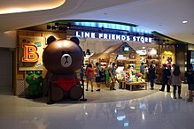

\#\#Question 1

    library(tidyverse)
    current_weather <- function(id){
      assertthat::assert_that(is.character(id))
      assertthat::assert_that(stringr::str_length(id) == 4)
      a <- xml2::read_xml(paste("https://w1.weather.gov/xml/current_obs/", id, ".xml", sep = ""))
      b <- xml2::xml_children(a)
      c <- data.frame(name = xml2::xml_name(b), text = xml2::xml_text(b))[c(6:10, 12:13, 17, 20),]
      row.names(c) <- 1:nrow(c)
      assertthat::assert_that(is.data.frame(c))
      c
    }
    current_weather("KAMW")

    ##                 name                                     text
    ## 1           location         Ames, Ames Municipal Airport, IA
    ## 2         station_id                                     KAMW
    ## 3           latitude                                 41.99056
    ## 4          longitude                                -93.61889
    ## 5   observation_time Last Updated on Apr 2 2019, 10:53 am CDT
    ## 6            weather                            Mostly Cloudy
    ## 7 temperature_string                           39.0 F (3.9 C)
    ## 8        wind_string             Northwest at 10.4 MPH (9 KT)
    ## 9           wind_mph                                     10.4

\#\#Question 2 \#\#\#color

<h1 style="background-color:MediumPurple;">
Twilight Sparkle
</h1>
<h1 style="background-color:SkyBlue ;">
Rainbow Dash
</h1>
<h1 style="background-color:Hotpink;">
Pinkie Pie
</h1>
<h1 style="background-color:WhiteSmoke;">
Rarity
</h1>
<h1 style="background-color:Orange;">
Applejack
</h1>
<h1 style="background-color:Khaki;">
Fluttershy
</h1>
\#\#\#Image

\#\#\#List
<ul style="list-style-type:disc;">
<li>
STAT580 Homework 5
</li>
<li>
STAT585 Lab 4
</li>
<li>
STAT585 Blog 10
</li>
</ul>
\#\#Question 3

\#\#\#1 background-color, font-size

\#\#\#2 The r code chunks start with
$&lt;pre class="r"&gt;&lt;code&gt;$.

\#\#\#3 The r output starts with
 &lt; *p**r**e* &gt;  &lt; *c**o**d**e*&gt;. The chunks of code and
output have different background colors.

\#\#Question 4

    Line_friends <- xml2::read_html("https://en.wikipedia.org/wiki/Line_Friends")
    img <- Line_friends %>% 
      rvest::html_nodes("img") %>%
      rvest::html_attr("src")
    p <- magick::image_read(paste("https:", img[1], sep = ""))
    print(p)  

    ## # A tibble: 1 x 7
    ##   format width height colorspace matte filesize density
    ##   <chr>  <int>  <int> <chr>      <lgl>    <int> <chr>  
    ## 1 PNG      174     24 sRGB       TRUE      2952 72x72

    p <- magick::image_read(paste("https:", img[2], sep = ""))
    print(p)

    ## # A tibble: 1 x 7
    ##   format width height colorspace matte filesize density
    ##   <chr>  <int>  <int> <chr>      <lgl>    <int> <chr>  
    ## 1 JPEG     219    146 sRGB       FALSE    12473 72x72

